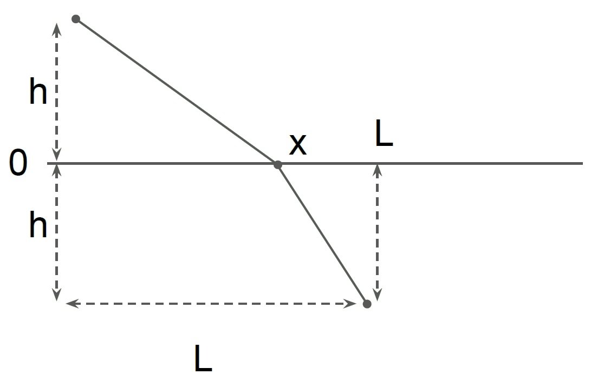
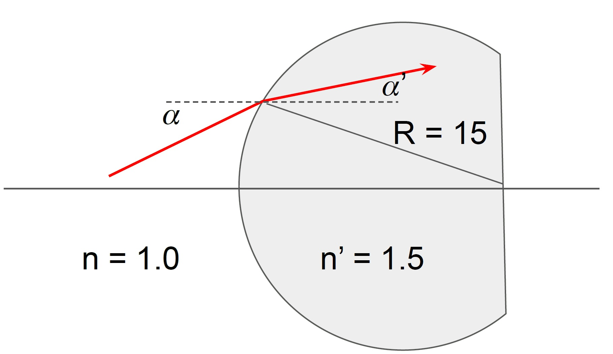
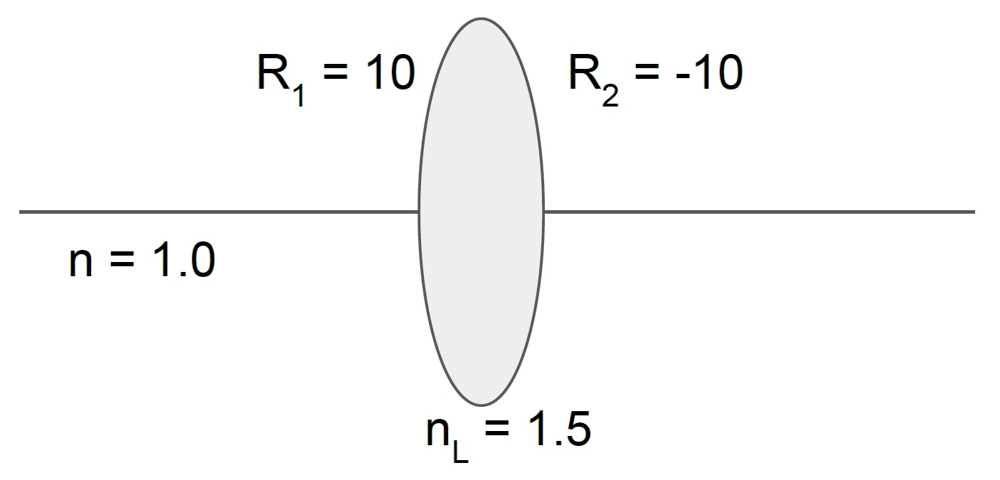
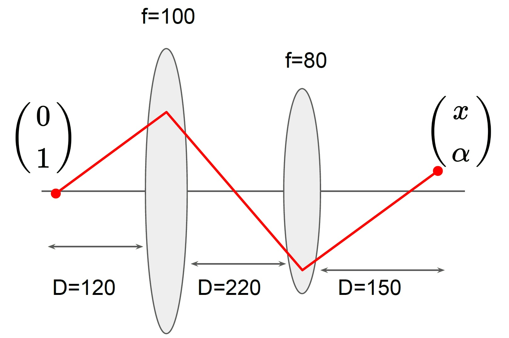
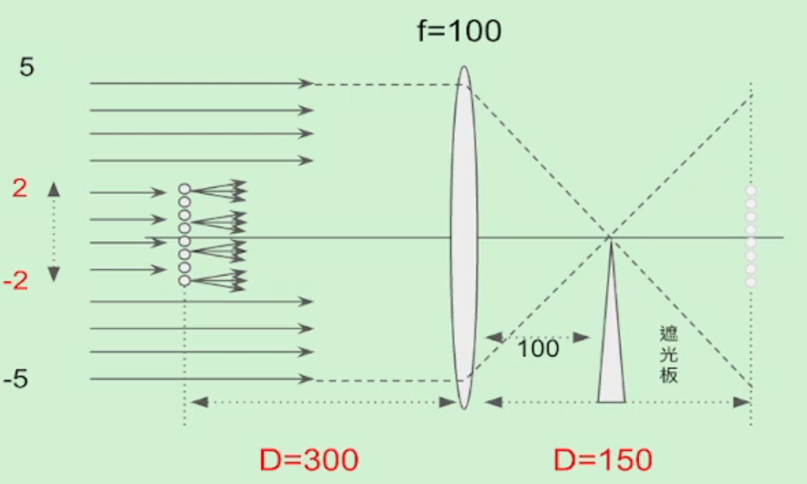
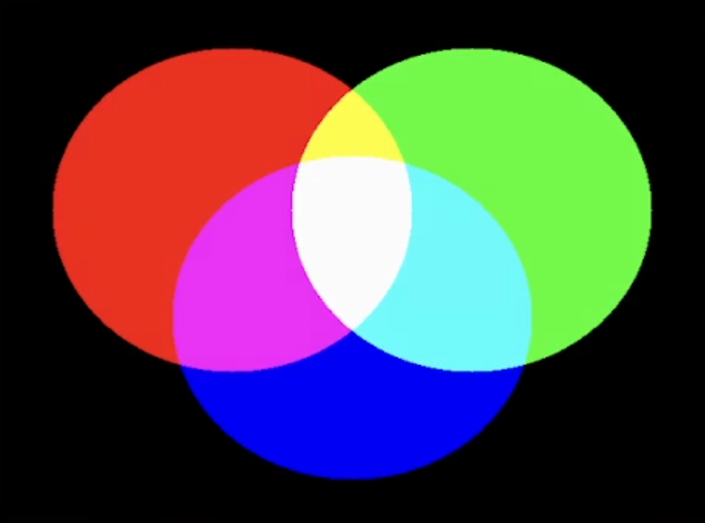
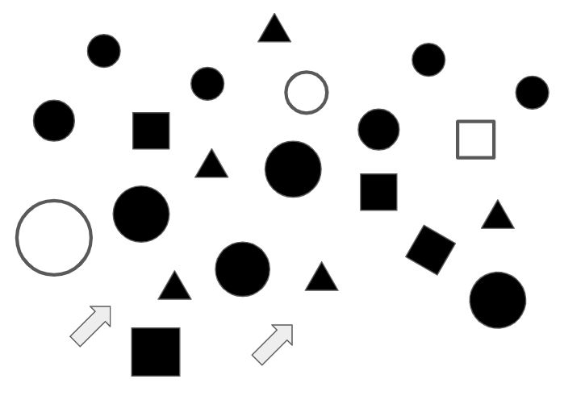
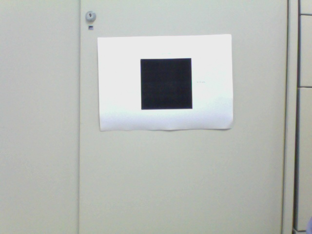
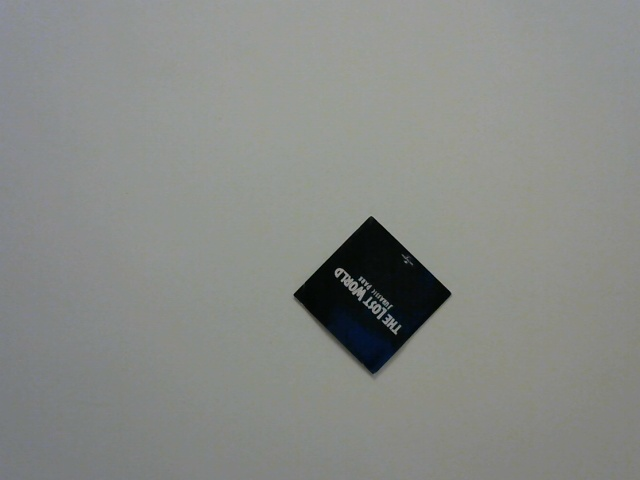
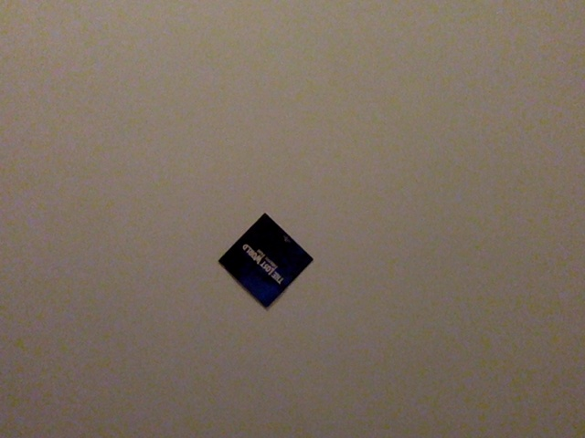

# ncu-course-AutomaticOpticalInspection
## 簡介
- **學校** : 國立中央大學
- **開課單位** : 機械工程學系
- **課程名稱** : 自動化光學檢測
- **授課教授** : 李朱育 教授
- **修課時間** : 2022年02月~2022年06月
- **最終成績** : 94

## 期中成績
|  上機1  |  上機2  |  筆試  |  總計  |
|--------|--------|--------|------|
|   25   |   25   |   44   |  94  |

## 期末專題
- 組別：第36組
- 組員：黃鉦淳、葉沛珅、陸弈元
- 影片連結1：https://youtu.be/SCvX9qRU3Wg
- 影片連結2：https://youtu.be/AP3a90r8Y54
- 專題說明：本專案圍繞自動化光學檢測的開發。其設計靈感源自**2021年東京威力科創機器人大賽（TEL Robotics Contest）複賽上半場「智慧賽道：關卡一 - 直線行走」**的挑戰。
- 最終成果：我們的自走車成功完成了該賽道挑戰。
- 核心功能與技術實現：
  透過本課程的學習與實作，我們為自走車實現了以下功能
  1. 單鏡頭視覺辨識： 自走車僅配備單一鏡頭進行環境感知與即時圖像辨識。
  2. 遠端預設指令： 在車輛啟動前，操作者可透過遠端連線至樹莓派，預先設定車輛需要依序穿越的顏色閘門序列。
  3. 全自動化行駛： 機器人能夠自主規劃路徑，從起點精準行駛至終點。
  4. 終點指令解析： 在終點區域，我們設計了特殊的指令標誌，包括方形方塊和圓形方塊。自走車成功辨識這些標誌後，將分別執行順時針旋轉或完全停止的動作。

## 作業介紹
- week03
   - 練習1
        > 一物件(紅色)至於直角反射鏡左側，如下圖。請根據反射定律，「繪」出反射靚所成的虛像。
   - 練習2
        > 輸入xy平面上兩點座標p1=(x1,y1), p2=(x2,y2)，然後計算出兩點距離，並輸出計算結果。
   - 練習3
        > xy 平面上有兩直線 L1: 5x+3y=10, L2: 3x+5y=5。寫一python 程式，計算兩直線之交點。
   - 練習4
        > 沿著直線L (x-2y+2=0) 放置一平面鏡M。位於 (-1, 2)的物點送出兩條光線，分別與反射鏡作用在 (-2,0) 及(0, 1)，並發生反射。試寫一python程式：
        (1) 繪出兩入射光線、反射光線的軌跡及兩反射光向後「延伸」的交點（虛像位置）。
        (2) 計算兩反射光向後延伸的交點位置。
    - 作業2
        > 一個拋物面鏡，只考慮x>0的部分，其方程式為$y=\sqrt{x}$，一反平行於x軸的入射光，經拋物面鏡反射後，射向焦點。無論入射光高度h為何值，反射光均會通過焦點。假設有三束高度分別為 0.01, 0.05, 0.10入射光射向拋物面鏡，請寫一python 程式，繪出他們的反射光線軌跡。

- week04
  - 練習1
    > 一道光線從空氣射向一塊厚度為5，折射率為1.5的玻璃平板，出射光將會與入射光產生一段平移量d，如圖所示。請剛具折射定律，寫一個python程式，繪出入射角d的關係。
    ``` python
    qi=np.linspace(0,90,100)*np.pi/180
    qr=np.arcsin(ni*np.sin(qi)/nr)
    l=t/np.cos(qr)
    d=l*np.sin(qi-qr)
    ```
  - 練習2
    > 寫一個python程式。用鍵盤 輸入(input+eval)
    (1) 入射介質折射率ni
    (2) 折射介質折射率nr
    (3) 入射角 qi
    程式輸出折射角 qr，若發生全反射，則輸出反射角。
  - 作業3
    > 光線經由稜鏡兩次折射後，前進方向會發生偏轉，偏轉量與稜鏡折射率、頂角以及入射角有關。
    試以 for 迴圈，找出
    (1) 最小偏轉角
    (2) 對應的入射角
    假設 n=1.5, A=30 degree
    

- week05
  - 練習1
    > 試以費馬定理推算出折射定律：$n_i\sin{\theta_i}=n_r\sin{\theta_r}$，請寫下推算過程，轉成pdf檔上傳表單。
    $$\mathbf{t} = \frac{l_i}{v_i} + \frac{l_r}{v_r} = \frac{\sqrt{x^2 + h^2}}{\frac{c}{n_i}} + \frac{\sqrt{(L-x)^2 + h^2}}{\frac{c}{n_r}}$$
    
  - 練習2
    > $x_0 = 1, \alpha = 1\degree, \alpha’ = ?$
    
  - 練習3
    > $$\begin{equation}
    M_{Lens} = 
    \left(\begin{array}{cc} a & b\\ c & d \end{array}\right)
    \end{equation}$$
    a = ?, b = ?, c = ?, d = ?
    
  - 作業4
    > 如下圖的雙薄透鏡系統。試寫一程式，求出 x, 𝛼
    

- week06
  - 練習1
    > 請仿照老師的操作方式:利用Chrome幾何光學app，掩飾文影技術，將一個透明的圓珠(折射率1.001)，成像在螢幕上。
  - 練習2
    > 下圖為紋影法光學架構，遮光板置於透鏡右側焦平面，可遮住光線。試寫一程式，調整遮光範圍，觀察成像面的光強度分佈。
    
  - 練習3
    > 一個函數(橘色)和一個方波函數(藍色)做卷積運算，是繪出卷積結果。

- week07
  - 隨堂練習
    > 有三個實心圓。請寫一程式，計算紅綠藍三個圓各自的面積(畫素個數)
    
  - 練習1
    > 以顯微鏡觀察岩石表面的實驗中，在不同的對焦距離下，取出了6張影像。
    將影像中某一線段上的強度分布取出來，存成 6個txt檔: g0t.txt, g1t.txt,...
    請寫一程式，找出最清楚的像所對應的 txt 檔
  - 練習2
    > 若欲匯入的圖片不在工作資料夾（例如在C:tmp），則該如何將此圖片匯入ITOM？ 請寫出此行程式碼。（cv2.imr...）
  - 練習3
    > 請利用imread匯入 lena.jpg，並將左上角20x20的畫素與右下角20x20 的畫素交換。img1=img0.copy()
  - 作業5
    > DVD讀寫頭中,投射在四象限偵測器上的光強度分布如圖所示.假設光強度均勻分布在橢圓中,橢圓方程式如左式. 假設對焦系統由位置0 um處移動到100處時,橢圓的兩軸(a,b)的變化如下圖所示. 試計算FES與位移的關係.
    

- week08
  - 練習1
    > 在300x300白色畫布上，畫一個半徑100，圓心在(150, 150)藍色圓
  - 練習2
    > 參考前頁程式碼，繪出右圖
    
  - 練習3
    > 仿照前頁點源干涉的原理及程式，繪出如右圖的干涉圖樣
    
  - 練習4
    > 在Lena的左上角畫一個正方形與其外接圓，然後存檔Lena_1.jpg

- week09
  - 練習1
    > cv2.addWeighted(img1, 0.7, img2, 0.3, 0) : 可以依照指定比例將兩張圖片混和起來
    請利用add或addWeighted函數，繪出如下圖的三原色圖重疊
    
  - 練習2
    > 將彩色的lena旋轉45度
  - 練習3
    > 將下圖的座標軸轉換成正交
    

- week10
  - 練習1
    > 將Lena加入「黑色」的雜訊，存成jpg圖檔。
    再將此摻雜訊的圖檔讀入，然後用「中值綠波」或「高斯濾波」函數將雜訊濾除。(比較)
  - 練習2
    > 下圖是一張對比度較差的照片，請利用equalizeHist來增加他的對比度，並繪出像素值分佈直方圖。
    
  - 練習3
    > 利用「迴圈」，每秒擷取一張畫面，並即時顯示出來(inshow)，共10秒。
  - 練習4
    > 將彩色的Messi5, Mess5p兩張做相減運算
    
    
  - 練習5
    > 擷取webcam或影片的即時畫面。將時間間隔1秒的兩張畫面做相減運算。上船相間運算的結果(圖片)。
  - 練習6
    > 參考前頁的程式碼，將差異圖片做「灰階圖」、「模糊化」及「二值化」運算。任意地調整GaussianBlur()與thresh()內的參數，然後上傳參數內容，與「二值化」後的照片。
  - 練習7
    > 請參考前頁的程式碼，將for迴圈改寫成while迴圈，並加入迴圈終止條件。

- week11
  - 練習1
    > 下圖有一大圓A，及數個小圓。試利用函數dilate()及erode()，消去小圓並留下大圓。
    
  - 練習2
    > 參考前頁的程式碼。將Google視為一個圖案，並繪出其輪廓。
    
  - 練習3
    > 如影片，兩枚硬幣置於計算紙上，請寫一程式，繪出移動硬幣的輪廓及其中心。
  - 練習4
    > 利用boundingRect及rectangle，以不同顏色的矩形，依序(間隔0.5秒)框住圖案。
    
  - 作業6
    > 偵測影片中移動的物件(人與車)，並排除樹梢的微擾。

- week12
  - 練習1
    > 利用Canny及相關函數，找出下圖的邊界。
    
  - 練習2
    > xy平面上有A,B~G七個點，將這七點做Hough轉換，並在r、$\theta$平面上繪出轉換的曲線。
    A(0,0),B(1,1),C(2,2),D(3,3),E(4,4),F(5,5),G(5,20)
  - 練習3
    > xy平面上有A,B,C,D,E,F七個點，請模仿前一頁程式碼，證明ABCE共線，DEF共線
    A(0,0),B(1,1),C(2,2),D(3,3),E(2,3),F(4,4),G(6,5)
  - 練習4
    > 繪出圖中直邊界的直線。
    
  - 練習5
    > 利用HoughLinesP找出右圖中的直線，並計算綠色與黃色板子的夾角。
    
  - 練習6
    > 圖中有多個圓形、三角形與矩形。
    請圈出圖中的圓形，並於圓心標示其面積。
    
  - 作業7
    > 試寫一個程式，利用webcam即時偵測桌面上中兩枚硬幣的距離(pixel)，並於左上角顯示此距離。
    (optional 若桌面上有多枚硬幣?)

- week13
  - 練習1
    > 找出圖中面積最大的輪廓
    
  - 練習2
    > 利用前頁自訂函數findMarker(img)與webcam，即時偵測畫面中最大面積的物件，並繪出其輪廓。
  - 練習3
    > 即時偵測最大輪廓，即時繪出最小外接矩，並在畫面右上角顯示矩形寬度(單位pixel)
  - 練習4
    > 利用上述程式與函數，完成webcam相機焦距校正與距離量測程式。

- week14
  - 練習1
    > 改寫前頁所說明的程式(xy軸，焦距，物件視角)，觀察影片motionPatterns3.mov中最大物件(正方形)的視角變化。
  - 練習2
    > 兩台相機焦距均為1000 pixel，相距30 cm，拍攝遠方紅色圓形，得到兩張相片如下。請找出紅色圓形與基線的距離。
    (optional)找出紅色圓形的(x,z)座標
    
    
  - 練習3
    > 兩台相機焦距分別為fL0=867與fL1=544 (單位pixel)，相距10cm。以兩相機中點為座標原點，計算畫面中黑色方塊的座標(xyz)。
    
    
  - 練習4
    > 利用前頁程式範例，找出畫面中著藍色洋裝女士的uv座標
    
  - 練習5
    > 找出畫面中橘色桌球的三維座標xyz
    f0 = 593 pixel，f1 = 675 pixel，兩相機相距18cm
    _Cam0.jpg)
    _Cam1.jpg)
  - 作業8
    > 偵測影片中橘色桌球的運動軌跡
    f0 = 593 pixel，f1 = 675 pixel，兩相機相距18cm

## 修課心得
這門課非常值得推薦。老師會從零基礎開始教，包括 Python 環境安裝和基礎語法。課程中後段會學習光學辨識的應用，特別是 OpenCV 套件。內容涵蓋光學理論，並帶領我們在 Webcam 上進行實際操作。理論與實作兼備，非常實用。